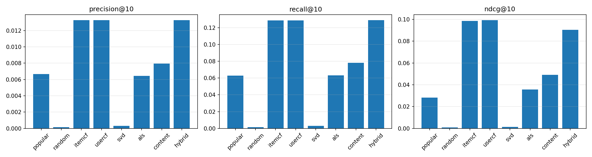
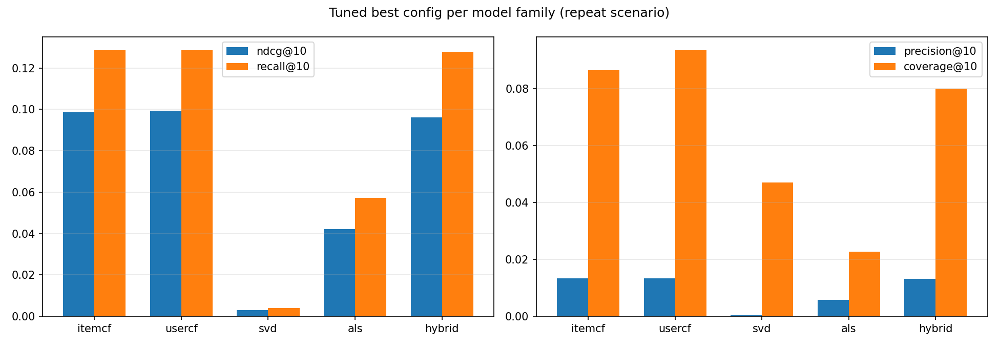

# Olist Recommender Optimisation — Final Report

> Data: Olist Brazilian e-commerce dataset (~100K orders, 96K customers, 33K products)
> Stack: MySQL (cleaning and profiling) + Python / scikit-learn (features, modelling, offline evaluation)
> Code: `recsys/`

---

## Executive summary

This project targets **recommender optimisation** on the public Olist dataset (~100K orders, 96K customers,
33K products) and covers the full chain: data cleaning → feature engineering → recommender modelling →
offline evaluation → operational strategy → data reflection.

**Three core findings:**

1. The repeat-purchase rate is only **3.12%**, and after a time-based split 98.6% of test users are cold-start
   — the main battleground is cold-start fallback. For returning buyers, collaborative filtering doubles the
   recall of the popularity baseline.
2. The explicit-rating model (SVD) predicts ratings decently (RMSE ≈ 1.05) but **ranks worst of all**; the
   implicit-feedback model (ALS) is clearly better — on sparse order data, **behaviour beats ratings**.
3. The hybrid (ItemCF-led, with content/ALS/SVD/popularity) performs best overall: NDCG@10 = **0.096** after
   tuning, with no regression on cold-start users.

**Recommended production configuration:** `ITEMCF_TOP_K=20`, popularity prior 0.05,
`SVD_K=40 / LR=0.01 / REG=0.02`, `ALS_K=40 / REG=5`,
`HYBRID_WEIGHTS={itemcf:0.55, content:0.15, als:0.10, svd:0.10, popular:0.10}`.

**Deliverables:** SQL profiling/cleaning scripts, one-command Python pipeline, two-scenario offline
evaluation, hyperparameter tuning study, operational strategy, and a data-reflection chapter.

---

## 1. Cleaning lesson: why repeat buyers disappeared

### 1.1 Symptom

Profiling the raw database counted **2,997** repeat buyers (3.12%). Yet when the interaction data was built
by joining orders to the *cleaned* customer table, the repeat-buyer count became **0**.

### 1.2 Root cause

In `02_cleaning_and_dedup.sql`, `clean_customers` keeps only the **most recent account** when one
`customer_unique_id` maps to several accounts (99,441 rows → 95,918).

`clean_orders`, however, keeps **all** orders, including those placed under old accounts. Joining
`clean_orders` to `clean_customers` on `customer_id` therefore loses the old accounts, making every user look
like a one-time buyer, so the repeat count collapsed to zero.

Three join variants compared:

| Variant | Repeat buyers |
|---|---|
| clean_orders JOIN clean_customers (cleaned table) | **0** |
| clean_orders JOIN raw customers (full mapping) | **2,943** (3.07%) |
| raw orders JOIN raw customers (full data) | 2,997 (3.12%) |

The 54-user gap to the full-data figure comes from the 244 invalid orders removed during cleaning (impossible
timestamps, no valid customer, and so on) — normal cleaning loss.

### 1.3 The underlying tension: one cleaning rule, two analytical needs

- **Customer counting / operational reporting**: de-duplicating to one row per entity is right — a person
  should count once.
- **Recommender user identity**: all historical orders of that entity (including old accounts) must be
  merged, otherwise the entire repurchase history disappears.

### 1.4 The fix

The cleaning step was **left untouched** (`clean_customers` as before). Instead, the Python export stage adds
a `user_map` table exported directly from the **raw** `olist_analysis.customers` table: a complete
`customer_id → customer_unique_id` mapping (99,197 rows, covering every order in `clean_orders`). Interaction
data is built from that mapping.

After the fix: repeat buyers recover to **2,558**, of which 1,257 are evaluable inside the candidate pool.

> Lesson: a cleaning rule cannot be designed before asking who will consume the data. Customer statistics
> and recommender systems need different definitions of "user".

---

## 2. How the repeat-purchase rate is computed

The repeat rate is calculated **in MySQL on the raw database** (`01_data_profiling.sql`, section 6); the
Python side only reuses the number. It can be recomputed with:

```sql
SELECT COUNT(*) AS total_users,
       SUM(order_cnt >= 2) AS repeat_buyers,
       ROUND(SUM(order_cnt >= 2) * 100.0 / COUNT(*), 2) AS repeat_rate_pct
FROM (
  SELECT c.customer_unique_id, COUNT(DISTINCT o.order_id) AS order_cnt
  FROM olist_analysis.orders o
  JOIN olist_analysis.customers c ON o.customer_id = c.customer_id
  GROUP BY c.customer_unique_id
) t;
```

Result: 96,096 users / 2,997 repeat buyers / **3.12%**.

---

## 3. What cold start means here

### 3.1 Definition

Cold start means a **new user or new item with no behavioural history**, so the system cannot infer
preferences from "what they bought before".

- New-user cold start: just registered, no browsing, clicks or purchases.
- New-item cold start: just listed, no sales, ratings or purchases.

### 3.2 In this project

After the time split, **7,304 of 7,408 test users (98.6%) have no training-period purchase** — they are
cold-start users. This is not an artefact of the evaluation design but a direct consequence of the ~3%
repeat rate: almost everyone buys once, so any "predict the next purchase" test runs into cold start.

### 3.3 Common remedies

| Situation | Typical strategy |
|---|---|
| New user | popularity charts, regional popularity, content matching (signup data, location), onboarding preference quiz, social graph |
| New item | category/attribute similarity to existing items, editorial picks, launch traffic boost |

### 3.4 What is implemented here

- `popular`: popularity fallback from the training period;
- `content`: for new users, fallback to **popular items within their state** (`state_pop`);
- `itemcf` / `usercf`: a 0.05-weight popularity prior is added to scores so new users never receive an
  all-zero list.

---

## 4. The eight recommenders in detail

### 4.1 Model list and principles

| Model | Family | Principle | In one line |
|---|---|---|---|
| popular | baseline | rank by number of training buyers | recommend the hottest items the user has not bought |
| random | baseline (lower bound) | random order | sanity check that the metrics behave |
| itemcf | collaborative filtering | item-item cosine similarity | people who bought A get items similar to A (Top-50 neighbours) |
| usercf | collaborative filtering | user-user cosine similarity | recommend what similar users bought (similarity built for active users) |
| svd | matrix factorisation | Funk-SVD trained with SGD | factorise the user x item rating matrix to predict 1-5 scores |
| als | matrix factorisation | implicit-feedback alternating least squares | factorise purchase behaviour (bought or not, how much) |
| content | content-based | cosine match on item features | user profile = mean feature vector of purchased items; cold-start friendly |
| hybrid | hybrid | weighted fusion | itemcf 0.40 / content 0.25 / als 0.15 / svd 0.10 / popular 0.10 |

### 4.2 Key results

**Scenario A: time split (last 20% of interactions; 7,408 test users, 98.6% cold start)**

| Model | precision@10 | recall@10 | ndcg@10 |
|---|---|---|---|
| popular | 0.00327 | 0.03184 | 0.01532 |
| random | 0.00014 | 0.00128 | 0.00061 |
| itemcf / usercf | 0.00327 | 0.03184 | 0.01531 |
| svd | 0.00034 | 0.00338 | 0.00134 |
| als | 0.00008 | 0.00081 | 0.00030 |
| content | 0.00317 | 0.03089 | 0.01482 |
| hybrid | 0.00327 | 0.03184 | 0.01413 |

Conclusion: when cold start dominates, popularity/content fallback is already at the ceiling and
collaborative filtering has nothing to work with.

**Scenario B: repeat-buyer holdout (last order as test; 1,257 evaluated users)**

| Model | precision@10 | recall@10 | ndcg@10 | recall@20 |
|---|---|---|---|---|
| popular | 0.00668 | 0.06298 | 0.02822 | 0.09719 |
| random | 0.00016 | 0.00159 | 0.00103 | 0.00477 |
| itemcf | 0.01329 | 0.12861 | 0.09856 | 0.15566 |
| usercf | 0.01329 | 0.12861 | 0.09938 | 0.15487 |
| svd | 0.00032 | 0.00318 | 0.00149 | 0.00636 |
| als | 0.00644 | 0.06325 | 0.03566 | 0.07836 |
| content | 0.00796 | 0.07810 | 0.04923 | 0.10594 |
| hybrid | 0.01329 | 0.12901 | 0.09044 | **0.16720** |

Segment highlights (recall@10):

- itemcf / usercf / hybrid reach **0.171** for returning users in the top five states (SP/RJ/MG/RS/PR);
- hybrid reaches 0.127 for high-value users;
- for the 417 cold-start users every model degrades to popularity level (≈0.070), confirming the cold-start
  conclusion.



### 4.3 Three core conclusions

1. **Collaborative filtering vs popularity**: among users with history, ItemCF/UserCF double the recall of the
   popularity baseline.
2. **Good rating accuracy is not good ranking**: SVD trains to RMSE 1.05 yet ranks last on every Top-K metric.
3. **Implicit feedback beats explicit feedback**: ALS (bought or not) clearly outperforms SVD (what score),
   confirming that behaviour is more reliable than ratings on sparse purchase data.

### 4.4 Hyperparameter tuning (grid search)

34 configurations were searched on Scenario B (objective NDCG@10): 12 ItemCF combinations of neighbourhood
size and popularity prior, 3 UserCF priors, 7 SVD combinations of factors, regularisation and learning rate,
9 ALS combinations of factors and regularisation, and 6 hybrid weightings. The best configuration was then
re-checked on cold-start Scenario A.

| Model | Best parameters | NDCG@10 after tuning | Reading |
|---|---|---|---|
| ItemCF | 20 neighbours, prior 0.05 | 0.0986 (flat vs default) | 20 neighbours saturate on sparse data; more is noise. Prior 0.05 is the most stable |
| UserCF | prior 0.05 | 0.0994 | default is already optimal |
| SVD | k=40, lr=0.01, reg=0.02 | 0.0029 | tuning cannot rescue ranking — the limit is the explicit-rating setup |
| ALS | k=40, reg=5 | 0.0420 | raising latent factors 20 → 40 helps clearly (default 0.036) |
| Hybrid | itemcf 0.55 / content 0.15 / als 0.10 / svd 0.10 / popular 0.10 | 0.0960 | +6.2% over default weights, with no regression in Scenario A |

**Recommended production configuration:** `ITEMCF_TOP_K=20`, popularity prior 0.05,
`SVD_K=40 / LR=0.01 / REG=0.02`, `ALS_K=40 / REG=5`,
`HYBRID_WEIGHTS={itemcf:0.55, content:0.15, als:0.10, svd:0.10, popular:0.10}`.

Three observations worth reporting: **neighbour saturation** (ItemCF identical at 20 and 200), **ALS is
sensitive to latent dimensionality** (k=40 is better), and **explicit-rating tuning is futile** (SVD stays
last under every setting).



> Artefacts: `recsys/output/tuning_results.csv` (all 34 configurations),
> `recsys/output/tuning_report.txt` (recommended configuration), `recsys/output/tuning_best_comparison.png`.

---

## 5. The two evaluation scenarios

**Scenario A: time split**

- the last 20% of interactions form the test set, so no future information leaks in;
- used to test the **cold-start fallback strategy** (98.6% of test users here are cold-start).

**Scenario B: repeat-buyer holdout**

- keep users with ≥2 orders; the last order is the test set and everything before it is training data;
- used to test **what CF and matrix factorisation can really achieve for users with history**.

**Shared protocol**

- candidate pool: the 5,000 most popular training items (covering ~61-65% of training interactions);
- items bought during training are filtered out, so only "new" items are recommended;
- model input uses training-period interactions only, avoiding leakage;
- metrics: Precision@K / Recall@K / NDCG@K (K = 5/10/20), coverage, diversity, novelty.

---

## 6. Operational strategy (from experiment to rollout)

### 6.1 Overall logic: segment the person, then the product, then the context

The two scenarios describe two completely different strategy contexts:

- **Scenario A**: 98.6% of test users are new — most traffic is first-time users, so the central question is
  "how do we recommend without history?";
- **Scenario B**: returning users — collaborative filtering doubles recall, so the value is "guess the next
  order of a known user".

Hence the first rule: **check whether the user has history, then route them down a different path.**

| User | Path | Evidence |
|---|---|---|
| New (no history) | regional popularity → global popularity → category onboarding | Scenario A: popularity/content fallback is the ceiling; CF has nothing to use |
| Returning | ItemCF / UserCF / hybrid → personalised ranking | Scenario B: CF doubles the recall of the popularity baseline |

### 6.2 People: operate by user value

Combining RFM segments with the experiment segments (cold_users / high_value / top5_states):

1. **High-value users** (top 20% by training spend): lead with the hybrid (Scenario B recall@10 = 0.127,
   best of the four groups), plus VIP perks, early access to new items and dedicated coupons; the candidate
   pool leans on tier-A high-margin items.
2. **Returning users in the top five states** (SP/RJ/MG/RS/PR): ItemCF/UserCF reach recall@10 = 0.171, the
   best anywhere — use collaborative filtering fully, recommending items bought by similar users.
3. **Dormant / low-frequency users** (have history but have not bought recently): prioritise
   re-activation — best-sellers, win-back coupons and content matching (content reaches recall@10 = 0.078,
   suited to users with too little behaviour for CF).
4. **New users**: follow the dedicated cold-start playbook in 6.5.

### 6.3 Product: tiered exposure (ABC x experimental metrics)

- **Tier A** (~23% of categories generating 80% of sales): guarantee hits — default pool for new users, home
  page slots, campaign front line;
- **Tier B** (mid-tail): cross-sell through ItemCF ("bought A, so B"), placed on product detail pages, cart and
  payment-success pages;
- **Tier C** (long tail): clearance, gifts or bundle mechanics with capped exposure.

The experiments show that "hot" and "broad" must be balanced:

| Model | coverage@10 | precision@10 (Scenario B) | Reading |
|---|---|---|---|
| popular | 0.002 | 0.0067 | only the few hottest items; extremely low coverage, monotonous list |
| random | 1.000 | 0.0002 | covers everything, hits almost nothing |
| itemcf | 0.087 | 0.0133 | moderate coverage with the best hit rate |
| hybrid | 0.114 | 0.0133 | best balance of hot and broad |

→ A recommendation feed should be neither "hot only" (boring, poor experience) nor "spray everything" (too
few hits). Build on collaborative filtering, back it with popularity and widen it with content.

### 6.4 Context: situational recommendation

- **Region**: the top five states have enough data for CF; remote or slow-logistics regions should be served
  items from nearby warehouses with good delivery times (bad reviews correlate strongly with logistics in
  this dataset), matched through content features;
- **Time**: push high-conversion tier-A items during promotions; for first orders push cheap best-sellers to
  lower the decision cost;
- **Price band**: filter the candidate pool by the price band in the user profile so nothing is recommended
  beyond what the user would consider.

### 6.5 Cold-start playbook (already implemented in code)

| Strategy | Where | Note |
|---|---|---|
| Global popularity fallback | `PopularModel` + the 0.05 prior in itemcf/usercf | new users never get an empty list |
| Regional popularity fallback | `state_pop` in `features.py` + `ContentModel` | recommends popular items in the user's state |
| Content profile | `ContentModel` | upgradeable to category-preference matching once browsing data exists |
| Hybrid weighting | `HybridModel` (popularity weight 0.10) | the most stable option in cold-start settings |

Further ideas (require extra data): onboarding preference quiz, browsing behaviour, same-device/same-address
linking.

---

## 7. Data reflection (full version)

Each item is written as symptom → impact on recommendation → improvement idea.

1. **Repeat-purchase rate of only 3.12%**
   - Symptom: only 2,997 of 96,096 users ever repurchase; 98.6% of test users are cold-start after a time split.
   - Impact: cold start is the natural main battleground and very few users can be served by CF.
   - Improvement: lift repurchase at the source (membership, incentives) and always report cold-start and
     returning users separately.
2. **No behavioural logs (browsing, clicks, carts, search)**
   - Symptom: only orders and reviews exist.
   - Impact: purchase is the only proxy for the target; SVD reaches RMSE 1.05 yet ranks worst precisely
     because the rating signal is weak and only covers users who already bought.
   - Improvement: add tracking and use clicks/carts as implicit feedback.
3. **No impression data**
   - Impact: position bias cannot be corrected (where an item is shown affects clicks), so offline results
     are an approximation under selection bias.
   - Improvement: log impressions for position-bias correction and validate online with A/B tests.
4. **Weak rating signal**
   - Symptom: 58% of scores are 5 and 58,247 reviews have no text.
   - Impact: this is exactly why ALS (implicit) clearly beats SVD (explicit).
   - Improvement: lean on behaviour, use ratings as a supplement; sentiment analysis must handle missing text.
5. **Multi-account order history (a real pitfall hit in this project)**
   - Symptom: repeat buyers counted as 0 after `clean_customers` de-duplication.
   - Impact: modelling must aggregate every historical order of a user through the full `user_map`.
   - Lesson: the same cleaning rule must be re-designed per analytical goal; define "user" before modelling.
6. **Geographically concentrated sample**
   - Symptom: users cluster in south-eastern Brazil; CF recall@10 = 0.171 in the top five states, well above
     other regions.
   - Impact: generalisation risk, and cold start is worse in remote areas.
   - Improvement: train and evaluate by region, and add regional features.
7. **Short time span (2016-09 to 2018-10)**
   - Impact: recency bias cannot be separated from long-term preference drift.
   - Improvement: introduce time decay so older interactions weigh less.
8. **Limits of the evaluation method**
   - Symptom: no real recommendation exposure, so every metric is an offline approximation.
   - Impact: neither the time split nor the holdout can replace online validation.
   - Improvement: run a small-traffic online A/B test and scale up only after CTR, conversion and GMV confirm
     the gain.

---

## 8. Conclusions and outlook

### 8.1 Conclusions

- **Method**: on sparse order data, collaborative filtering (ItemCF/UserCF) remains the most cost-effective
  approach; weighted hybridisation absorbs several views and is the most stable overall; implicit feedback
  (ALS) clearly beats explicit ratings (SVD).
- **Business**: solve cold start first with regional popularity and content profiles, then use collaborative
  filtering for users with history. High-value users and the top regions gain the most from CF.
- **Data**: this dataset has a clear ceiling for recommender work (no behavioural logs, no impressions, very
  low repeat rate). It suits algorithm comparison and offline simulation, not direct production use.

### 8.2 Limitations

- offline evaluation cannot replace online A/B testing;
- without impression data, position bias cannot be corrected and selection bias remains;
- the rating signal is weak (58% fives) and the only behavioural signal is orders;
- the uneven geographic distribution puts generalisation at risk.

### 8.3 Outlook

- add behavioural tracking (impressions, clicks, carts) with time decay and position-bias correction;
- run a small-traffic online A/B test and validate with CTR, conversion rate and GMV before scaling;
- add product text and image features for multimodal content recommendation;
- build membership and repurchase incentives to attack the structural 3% repeat rate at the source.

---

## 9. Artefact list

| File | Description |
|---|---|
| `recsys/run_all.py` | one command: export → features → 8 models → both evaluation scenarios |
| `recsys/output/time_split_*.csv/png/txt` | Scenario A metrics, segments, report, figures |
| `recsys/output/repeat_*.csv/png/txt` | Scenario B metrics, segments, report, figures |
| `recsys/output/tuning_*.csv/png/txt` | tuning: 34 configurations, best setup, comparison figure |
| `data_profiling_report.txt` / `cleaning_report.txt` | before/after cleaning comparison and reason breakdown |
