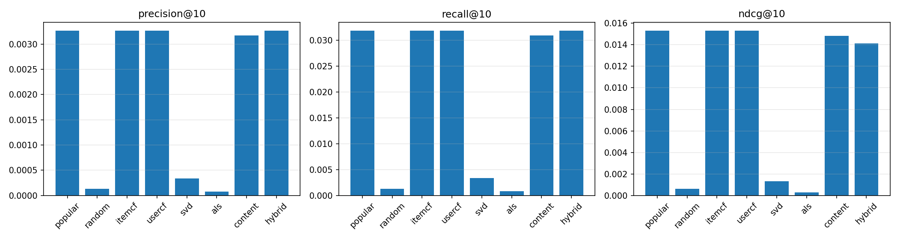

# E-commerce Recommender Optimisation (Olist)

An end-to-end recommender-systems project on the public Olist dataset: **MySQL data profiling and cleaning → people–product–context feature engineering → eight recommenders → two leakage-free offline evaluation protocols → hyperparameter tuning → operational strategy and data reflection**.

---

## 1. Key findings

1. **The data dictates the battleground.** Only **3.12%** of customers ever repurchase (2,997 users). After a time-based split, **98.6%** of test-period users have no purchase history at all, and every model collapses to popularity fallback (Recall@10 ≈ 0.032). Cold-start coverage matters far more than fine-grained personalisation on this dataset.
2. **Collaborative filtering only shows its value on users with history.** In the repeat-buyer holdout, ItemCF and UserCF reach **Recall@10 = 0.129**, roughly **2×** the popularity baseline (0.063); among users in the top five states, ItemCF reaches **0.171**.
3. **Accurate rating prediction is not the same as good ranking.** Funk-SVD has the lowest rating error (RMSE ≈ 1.05) yet the worst ranking quality (NDCG@10 = 0.003, below the popularity baseline). On sparse order data, **implicit behaviour signals are more reliable than explicit ratings**.
4. **The hybrid is the robust choice.** A weighted blend led by ItemCF (with content, ALS, SVD and popularity) lifted NDCG@10 from 0.090 to **0.096** (+6.2%) after a 34-configuration grid search, with no regression on cold-start users.

## 2. Data source

- Dataset: **Brazilian E-Commerce Public Dataset by Olist** (Kaggle) – eight related tables covering orders, order items, customers, products, payments, reviews, sellers and category translation.
- Licence: **CC BY-NC-SA 4.0** (attribution, non-commercial, share-alike). **No raw data is included in this repository**; download it from Kaggle: <https://www.kaggle.com/datasets/olistbr/brazilian-ecommerce>
- Scale used here: ~100K orders, 96K customers, 33K products, 99K reviews.
- The SQL dumps and exported CSVs are runtime artefacts produced locally on MySQL 8.0 + Python and are excluded from the repository (see `.gitignore`).

## 3. Repository layout

```
.
├── 01_data_profiling.sql        # profiling: row counts, duplicates, nulls, impossible timestamps
├── 02_cleaning_and_dedup.sql    # cleaning: de-duplication, dirty-row removal, 8 clean tables + cleaning log
├── data_profiling_report.txt    # output of script 01
├── cleaning_report.txt          # output of script 02 (before/after comparison)
├── DATA_SETUP.md                # loading the raw CSVs into MySQL and running the SQL scripts
├── recsys/                      # recommender modelling code
│   ├── config.py                # paths and experiment settings (DB password via env / .env)
│   ├── .env.example             # template for local configuration
│   ├── export_data.py           # MySQL -> CSV export (includes the full user mapping)
│   ├── features.py              # interaction matrix, user/item features, time split, repeat holdout
│   ├── models.py                # eight recommenders
│   ├── evaluate.py              # Top-K metrics, coverage/diversity/novelty, segments, figures
│   ├── tune.py                  # 34-configuration grid search
│   ├── run_all.py               # runs both scenarios end to end
│   └── output/                  # evaluation results (CSV / TXT / PNG, committed)
├── PROJECT_REPORT.md            # full write-up: findings, lessons, model comparison, strategy
├── CODE_WALKTHROUGH.md          # line-by-line walkthrough of the SQL and Python code
├── PROJECT_PAPER.md             # paper-style report with figures
├── PROJECT_OUTLINE.md           # project plan and framework
└── RESUME_BULLETS.md            # resume entries for this project
```

## 4. Environment and how to run

Requirements: MySQL 8.0 and Python 3.9+ (pandas / numpy / scipy / scikit-learn / matplotlib / pymysql).

```bash
pip install pandas numpy scipy scikit-learn matplotlib pymysql
```

**Step 1 – prepare the database.** Load the raw CSVs into MySQL following `DATA_SETUP.md`, then run:

```bash
mysql -u root -p < 01_data_profiling.sql
mysql -u root -p < 02_cleaning_and_dedup.sql
```

**Step 2 – configure the local password.** It is never hard-coded; copy the template and fill it in (`.env` is git-ignored):

```bash
cd recsys
cp .env.example .env          # Windows: copy .env.example .env
# then edit .env and set DB_PASSWORD
```

Environment variables `DB_HOST` / `DB_PORT` / `DB_USER` / `DB_PASSWORD` / `DB_NAME` also work.

**Step 3 – run the pipeline.**

```bash
cd recsys
python run_all.py            # export -> features -> train -> evaluate both scenarios
python tune.py               # optional: 34-configuration grid search
```

Results land in `recsys/output/`: metric tables, segment tables, text reports and comparison figures.

## 5. Experiment design

**Two leakage-free evaluation protocols** (the main difference from a random-split setup):

| Scenario | Split | Purpose |
|---|---|---|
| A: time-based | Sort by `order_purchase_timestamp`; the last 20% of interactions form the test set | Measures the real "predict the future" ability and cold-start fallback |
| B: repeat holdout | Keep users with ≥2 orders; hold out each user's **last order** | Measures the achievable ceiling for CF/MF on users with history |

**Shared protocol**: the candidate pool is the 5,000 most popular training items; items already bought during training are filtered out; only training-period information is used as model input.

**Eight models**: `popular` (baseline), `random` (lower bound), `itemcf` (cosine similarity + Top-K neighbours + popularity prior), `usercf` (user neighbourhoods), `svd` (Funk-SVD trained with SGD), `als` (implicit-feedback matrix factorisation), `content` (category / price / quality features) and `hybrid` (weighted blend).

**Metrics**: Precision@K, Recall@K, NDCG@K (K = 5/10/20), coverage, diversity and novelty, compared across cold-start users, high-value users, top-five states and other returning users.

## 6. Results

Scenario B (repeat holdout; 1,257 evaluated users, 417 of them cold-start):

| Model | Recall@10 | NDCG@10 | Coverage@10 |
|---|---|---|---|
| popular (baseline) | 0.0630 | 0.0282 | 0.24% |
| itemcf | **0.1286** | 0.0986 | 8.66% |
| usercf | **0.1286** | 0.0994 | 9.36% |
| als | 0.0632 | 0.0357 | 1.80% |
| content | 0.0781 | 0.0492 | 50.0% |
| hybrid | 0.1290 | 0.0904 | 11.44% |
| svd | 0.0032 | 0.0015 | 1.98% |
| random (lower bound) | 0.0016 | 0.0010 | 91.8% |

Segment view (ItemCF, Recall@10): top-five states 0.171 > other returning users 0.153 > high-value users 0.117 > cold-start users 0.070 (identical to the popularity fallback).




**Hyperparameter tuning** (`tune.py`, 34 configurations): ItemCF saturates at `top_k = 20`, the same diminishing-returns pattern Sarwar et al. reported on MovieLens. The best hybrid weights are `{itemcf: 0.55, content: 0.15, als: 0.10, svd: 0.10, popular: 0.10}`, improving NDCG@10 from 0.090 to 0.096 with no regression in Scenario A.

## 7. Reflections and known limitations

- **Cleaning rules must be defined per downstream use case.** De-duplicating customers to one row per entity (`customer_unique_id`) is correct for reporting, but it silently erased repeat-purchase history for the recommender (repeat buyers briefly counted as zero). The fix was to rebuild the full `customer_id → customer_unique_id` mapping from the raw table during export instead of changing the cleaning output. See section 1 of `PROJECT_REPORT.md`.
- **Reviews are order-level.** A review belongs to an order, so every item in that order shares one score and true per-item ratings are unavailable. This is one reason explicit-rating modelling performs poorly here.
- **No fine-grained behavioural stream.** Browsing, cart and wishlist events are missing, so cold-start users can only be served by popularity and content features.
- **The candidate pool is limited to 5,000 popular items**, so the evaluation does not cover the long tail – a deliberate simplification.

## 8. Documentation

- `PROJECT_REPORT.md` – full report (executive summary, cleaning lesson, model comparison, operational strategy, data reflection).
- `CODE_WALKTHROUGH.md` – line-by-line walkthrough of the SQL and Python code; useful as interview or defence notes.
- `PROJECT_PAPER.md` – paper-style report with figures.
- `recsys/README.md` – module-level documentation.

## 9. Method references

- Sarwar, B., Karypis, G., Konstan, J., Riedl, J. (2001). *Item-Based Collaborative Filtering Recommendation Algorithms.* WWW '01.
- Hu, Y., Koren, Y., Volinsky, C. (2008). *Collaborative Filtering for Implicit Feedback Datasets.* ICDM '08.
- Koren, Y., Bell, R., Volinsky, C. (2009). *Matrix Factorization Techniques for Recommender Systems.* IEEE Computer.
- Järvelin, K., Kekäläinen, J. (2002). *Cumulated Gain-based Evaluation of IR Techniques.* ACM TOIS.
